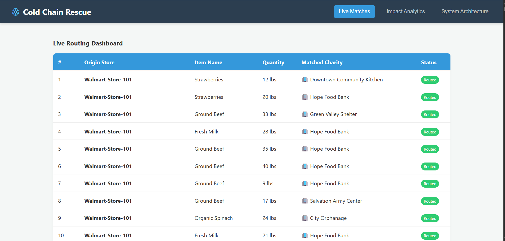
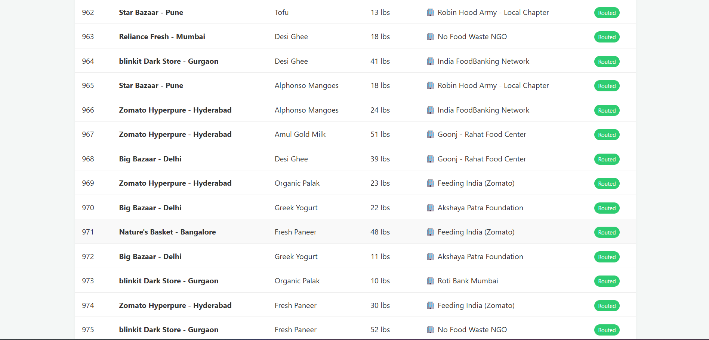
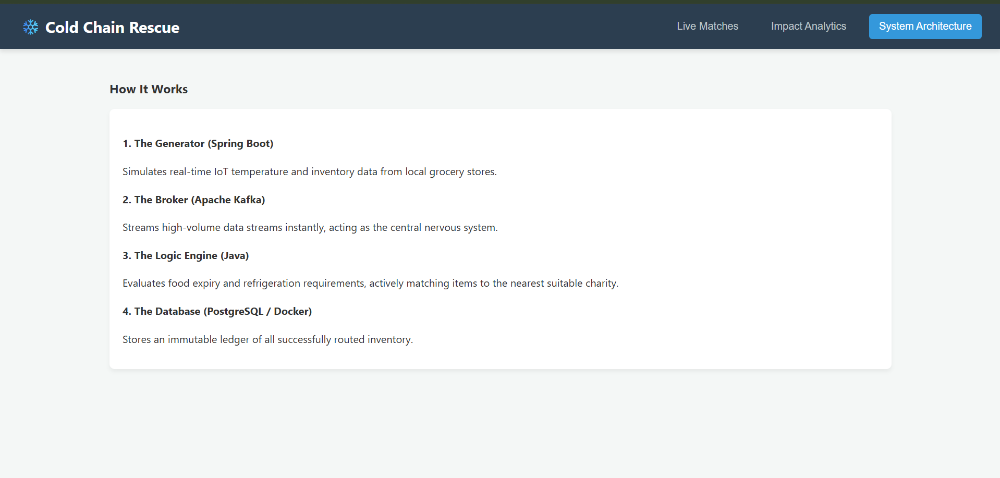
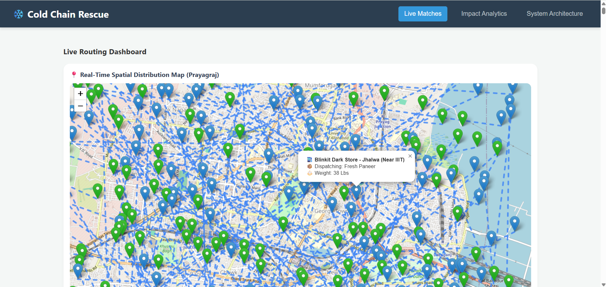

# ♻️ NourishFlow


## 🎯 Project Objective

**NourishFlow** is an intelligent, event-driven microservice system that significantly alleviates restaurant and supermarket food wastage by:

1. **Real-time Inventory Monitoring**: Streams inventory data from retail stores to detect high-risk perishable items
2. **AI-Powered Expiry Prediction**: ML models predict exact spoilage times based on temperature, humidity, and item characteristics
3. **Optimized Food Redistribution**: Intelligent routing algorithms match surplus food with NGOs and community centers
4. **Geospatial Visualization**: Interactive live map tracking of food from retailers to charitable organizations

## 👋 The Problem I'm Trying to Solve

Millions of tons of edible food are discarded daily due to logistical inefficiencies. Perishable items (milk, dairy, vegetables) require refrigeration but lack real-time visibility into expiry timelines. NGOs have no systematic way to know what food is available and when.

**NourishFlow Solution**: Acts as a real-time monitoring hub for supermarkets and restaurants:
- Automatically alerts when products are at risk of expiry
- Predicts exact hours before spoilage using ML models
- Intelligently routes surplus food to the nearest NGO with appropriate cold chain capabilities
- Provides geospatial tracking from source to destination

## ✨ Key Features

### 🧠 AI/ML Powered Features

* **Predictive Expiry Forecasting (Feature 1):** 
  - Predicts exact hours remaining before food spoilage
  - Considers: Storage temperature, humidity, item type, shelf-life patterns
  - Risk Assessment: Automatic categorization (LOW, MEDIUM, HIGH, CRITICAL)
  - Enables proactive redistribution instead of disposal

* **Demand-Optimized Routing (Feature 2):**
  - Scores NGOs based on capacity, demand patterns, and delivery distance
  - Provides confidence scoring for match reliability
  - Maximizes food utilization and minimizes transport waste

### 🔄 Core Features

* **Event-Driven Architecture:** Apache Kafka for high-throughput inventory streaming
* **Duplicate Detection:** Prevents duplicate food redistribution through caching and database constraints
* **Real-Time Match Engine:** Dynamically matches surplus alerts against NGO refrigeration capabilities
* **Cold Chain Validation:** Ensures items requiring refrigeration reach NGOs with active cold storage
* **Interactive Live Map:** React Leaflet + OpenStreetMap visualization of food routes in Prayagraj
* **Full-Stack Containerization:** Docker Compose orchestration of all services

## 📊 Tech Stack

| Component | Technology | Purpose |
|-----------|-----------|---------|
| Event Stream | Apache Kafka 7.5.0 | Real-time event broker |
| Backend | Spring Boot 4.0 (Java 17+) | Kafka consumer, business logic, API |
| Database | PostgreSQL 15 | Persistent storage |
| ML Engine | Python 3.11 + FastAPI | Expiry prediction & routing optimization |
| ML Models | scikit-learn, XGBoost | Time-series forecasting & classification |
| Frontend | React 18 + Leaflet | Geospatial dashboard |
| Containerization | Docker + Docker Compose | Full-stack orchestration |

## 🏗️ System Architecture 

```
┌─────────────────────────────────────────┐
│  1. INVENTORY SIMULATOR (Kafka Producer)
│     Generates food items from supermarkets
└──────────────┬──────────────────────────┘
               │
               ▼
┌─────────────────────────────────────────┐
│  2. APACHE KAFKA (Event Broker)
│     Topic: food-inventory-stream
└──────────────┬──────────────────────────┘
               │
               ▼
┌─────────────────────────────────────────┐
│  3. MATCH ENGINE (Kafka Consumer)
│     ├─ Duplicate Detection ✅
│     ├─ ML: Expiry Prediction 🧠
│     ├─ ML: Routing Optimization 🧠
│     ├─ Cold Chain Validation ❄️
│     └─ Geospatial Coordinates 📍
└──────────────┬──────────────────────────┘
               │
       ┌───────┼───────┐
       │       │       │
       ▼       ▼       ▼
    PostgreSQL ML API REST API
               │
               ▼
┌─────────────────────────────────────────┐
│  4. REACT DASHBOARD (Live Map)
│     Visualizes routes & match analytics
└─────────────────────────────────────────┘
```

## 🤖 ML Engine Architecture

**Python FastAPI Microservice** with two main endpoints:

**Endpoint 1: `/predict-expiry` (POST)**
- Input: item_type, storage_temp_c, humidity_percent, days_until_expiry
- Output: predicted_hours_remaining, risk_level, critical_risk
- Logic: Temperature & humidity factors degrade predicted shelf-life

**Endpoint 2: `/optimize-routing` (POST)**
- Input: food item details + list of nearby NGOs
- Output: recommended_ngo_id, confidence_score, reasoning
- Logic: Scores NGOs by capacity, time-of-day demand, distance, compatibility

## 📁 Project Structure

```
NourishFlow/
├── backend/
│   ├── src/main/java/com/coldchain/simulator/
│   │   ├── FoodDataProducer.java              # Inventory simulator
│   │   ├── FoodDataConsumer.java              # Kafka consumer with ML ⭐
│   │   ├── MLPredictionClient.java            # ML service client ⭐
│   │   ├── RestTemplateConfig.java            # HTTP config ⭐
│   │   ├── InventoryItem.java                 # Food item model
│   │   ├── MatchHistory.java                  # Match data model
│   │   └── DataController.java                # REST API
│   └── pom.xml
│
├── ml-engine/                    ⭐ NEW
│   ├── main.py                   # FastAPI ML endpoints
│   ├── requirements.txt          # Python dependencies
│   └── Dockerfile
│
├── frontend/
│   ├── src/
│   └── package.json
│
└── docker-compose.yml            ⭐ UPDATED
```

## 🚀 Quick Start

### Prerequisites
- Docker & Docker Compose
- Java 17+
- Node.js 16+

### Step 1: Start Infrastructure

```bash
docker-compose up --build
```

This starts:
- Zookeeper (Kafka coordination)
- Kafka broker (event streaming)
- PostgreSQL (data storage)
- ML Inference Engine (Python FastAPI) ⭐

### Step 2: Start Spring Boot Backend

```bash
cd backend
./mvnw spring-boot:run
```

Backend runs on `http://localhost:8080`

### Step 3: Start React Frontend

```bash
cd frontend
npm install
npm start
```

Dashboard opens at `http://localhost:3000`

### Step 4: Verify Services

```bash
# ML Service health
curl http://localhost:8000/health

# Backend API
curl http://localhost:8080/api/matches
```

## 📡 API Endpoints

### Backend REST API

```bash
# Get all redistribution matches
GET /api/matches

Response: [
  {
    "id": 1,
    "itemId": "uuid-xxx",
    "originStore": "Reliance Fresh - Civil Lines",
    "itemName": "Fresh Paneer",
    "quantityLbs": 25,
    "charityName": "Feeding India",
    "matchTime": "2024-01-15T14:30:00",
    "sourceLat": 25.4358, "sourceLng": 81.8463,
    "destLat": 25.4400, "destLng": 81.8500
  }
]
```

### ML Engine API

```bash
# Predict expiry hours
POST http://localhost:8000/predict-expiry
{
  "item": {
    "item_type": "Fresh Paneer",
    "weight_lbs": 10.0,
    "storage_temp_c": 4.0,
    "humidity_percent": 65.0,
    "days_until_expiry": 2
  }
}

# Optimize NGO routing
POST http://localhost:8000/optimize-routing
{
  "item": { ... },
  "ngos": [
    {
      "ngo_id": "NGO_1",
      "name": "Feeding India",
      "distance_km": 2.5,
      "current_time_hour": 14,
      "avg_daily_capacity_lbs": 450.0
    }
  ]
}

# Health check
GET http://localhost:8000/health
```

## 🔄 Event Flow Example

1. **Producer generates**: Supermarket sends milk (45 lbs, expires in 1 day)
2. **Kafka ingests**: Message routed to `food-inventory-stream` topic
3. **Consumer processes**:
   - ✅ Duplicate check: PASSED
   - 🧠 ML Expiry: 28.5 hours remaining (CRITICAL)
   - 🧠 ML Routing: Best NGO = "Feeding India" (0.92 confidence)
   - ❄️ Cold chain: PASSED
4. **Database saves**: Match record with coordinates
5. **Frontend displays**: Route from supermarket to NGO on live map

## 📸 Screenshots

| Dashboard View 1 | Dashboard View 2 |
| :---: | :---: |
|  |  |
| **Impact Analytics** | **Architecture Flow** |
|  |  |
| **Live Map - Prayagraj** | |

<p align="center">
  
</p>

## 🛑 Troubleshooting

### ML Service Not Responding
```
Check: docker ps | grep ml_inference_engine
Health: curl http://localhost:8000/health
Logs: docker logs ml_inference_engine
```

### Kafka Consumer Stuck
```
Logs: docker logs kafka_broker
Status: docker exec kafka_broker kafka-consumer-groups --list
```

### Database Connection Error
```
Check: docker ps | grep food_waste_db
DB: docker exec food_waste_db psql -U user -d food_waste
```

## 📝 Key Updates

### New in Latest Version

- ✅ **ML Engine Integration**: Python FastAPI service for expiry prediction & routing optimization
- ✅ **Enhanced Consumer**: Java consumer now calls ML service for intelligent decisions
- ✅ **ML Configuration**: application.properties supports ML engine URL configuration
- ✅ **Docker Compose Update**: Includes ML container with auto-startup
- ✅ **Fallback Logic**: System continues working if ML service is unavailable

---

<div align="center">
  <p>⭐ If this helps reduce food waste, please star the repository! ⭐</p>
  <p>Together, we can make a difference in feeding communities. 🌍💚</p>
</div>
